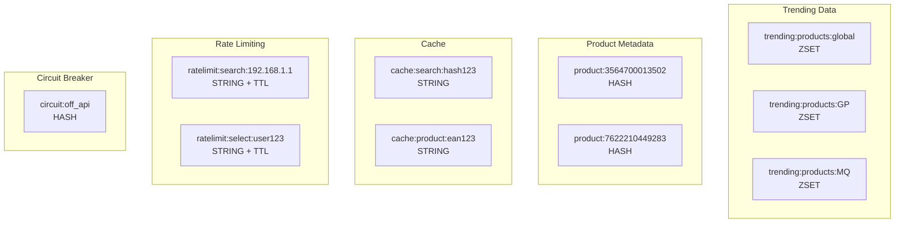

# Product Search, Trending, Resilience & Observability Architecture

## Table of Contents

1. [Functional Overview](#functional-overview)
2. [Architecture Components](#architecture-components)
3. [Product Search Lifecycle](#product-search-lifecycle)
4. [API Endpoints Reference](#api-endpoints-reference)
5. [Redis Data Model](#redis-data-model)
6. [Observability & Monitoring](#observability--monitoring)
7. [Configuration](#configuration)
8. [Testing Strategy](#testing-strategy)
9. [Accessibility & UX](#accessibility--ux)
10. [Roadmap](#roadmap)
11. [Security & Privacy](#security--privacy)

---

## Functional Overview

### Product Search Lifecycle

The product search subsystem provides a real-time, debounced search experience with trending insights, resilience patterns, and comprehensive observability.

**Flow:**
1. **User Input** → User types a product query in the `ProductSearch` component
2. **Debounce** → 250ms delay to avoid excessive API calls
3. **Backend Request** → GET `/api/products/search?q=<query>&territory=<territory>`
4. **Open Food Facts (OFF)** → Backend queries OFF API for product data
5. **Re-ranking** → (Planned) Results re-ranked by relevance, trending score, and local availability
6. **Selection** → User clicks a product from the results
7. **Trending Update** → (Planned) Selection tracked in Redis for trending calculations
8. **Display** → Product displayed with name, brand, image, and EAN

```mermaid
sequenceDiagram
    participant User
    participant ProductSearch
    participant Backend
    participant OFF as Open Food Facts
    participant Redis
    participant Metrics as Prometheus

    User->>ProductSearch: Types query
    ProductSearch->>ProductSearch: Debounce 250ms
    ProductSearch->>Backend: GET /api/products/search?q=...
    Backend->>Metrics: Increment search_requests_total
    Backend->>Redis: Check cache (planned)
    Redis-->>Backend: Cache miss/hit
    Backend->>OFF: Query products
    OFF-->>Backend: Product list
    Backend->>Redis: Cache results (planned)
    Backend->>Metrics: Record response_time
    Backend-->>ProductSearch: Return products
    ProductSearch-->>User: Display results
    User->>ProductSearch: Click product
    ProductSearch->>Backend: POST /api/products/select (planned)
    Backend->>Redis: ZINCRBY trending:products
    Backend->>Redis: HSET product:<ean>
    Backend->>Metrics: Increment selection_total
    Backend-->>ProductSearch: Success
    ProductSearch->>Backend: GET /api/products/trending (planned)
    Backend->>Redis: ZREVRANGE trending:products
    Backend-->>ProductSearch: Trending list
```

---

## Architecture Components

### Frontend Components

#### ProductSearch Component (`/src/components/ProductSearch.jsx`)

**Current Implementation:**
```jsx
// Core features
- Debounced search input (250ms)
- Real-time product search
- Loading states
- Results dropdown
- Product selection handler
```

**Key Features:**
- **Debouncing:** 250ms delay prevents excessive API calls
- **Territory-aware:** Filters by user's selected territory (Guadeloupe, Martinique, etc.)
- **Accessible:** Keyboard navigation support
- **Responsive:** Mobile-first design with Tailwind CSS

**Planned Enhancements:**
- ARIA combobox pattern implementation
- aria-live announcements for screen readers
- Zero-results handling with suggestions
- Escape key to clear search
- Multi-select mode for basket building

### Backend Controllers

#### ProductsController (`/backend/app/Controllers/ProductsController.ts`)

**Current Implementation:**
```typescript
class ProductsController {
  async search({ request, response }) {
    // 1. Validate query (min 3 chars)
    // 2. Extract territory parameter
    // 3. Query Open Food Facts API
    // 4. Map and filter results
    // 5. Return top 15 products
  }
}
```

**Planned Resilience Features:**
- Circuit breaker pattern for OFF API failures
- Rate limiting per IP/user
- Response caching with Redis
- Timeout configuration
- Fallback to local product database

#### Planned Controllers

**TrendingController** (Future)
```typescript
class TrendingController {
  async getTrending({ request, response }) {
    // Get trending products from Redis ZSET
    // Filter by territory and time window
    // Apply decay scoring algorithm
  }
  
  async recordSelection({ request, response }) {
    // Track product selection
    // Update trending score
    // Store selection metadata
  }
}
```

### Redis Data Structures (Planned)

Redis will serve as a high-performance cache and trending data store.

**Key Responsibilities:**
- Search result caching
- Trending product tracking
- Rate limit counters
- Circuit breaker state
- Session management

**Connection Configuration:**
```javascript
const redis = new Redis({
  host: process.env.REDIS_HOST,
  port: process.env.REDIS_PORT,
  password: process.env.REDIS_PASSWORD,
  tls: process.env.REDIS_TLS === 'true' ? {} : null,
  retryStrategy: (times) => Math.min(times * 50, 2000)
});
```

### Circuit Breaker Pattern (Planned)

Protects against cascading failures when Open Food Facts API is unavailable.

**States:**
- **CLOSED:** Normal operation, requests flow through
- **OPEN:** Too many failures, requests fail fast
- **HALF_OPEN:** Test if service recovered

**Thresholds:**
- Failure threshold: 5 failures in 60 seconds
- Success threshold: 2 consecutive successes to close
- Timeout: 30 seconds in OPEN state

```javascript
class CircuitBreaker {
  constructor(failureThreshold = 5, timeout = 30000) {
    this.state = 'CLOSED';
    this.failureCount = 0;
    this.nextAttempt = Date.now();
  }
  
  async execute(fn) {
    if (this.state === 'OPEN') {
      if (Date.now() < this.nextAttempt) {
        throw new Error('Circuit breaker is OPEN');
      }
      this.state = 'HALF_OPEN';
    }
    
    try {
      const result = await fn();
      this.onSuccess();
      return result;
    } catch (error) {
      this.onFailure();
      throw error;
    }
  }
}
```

### Rate Limiting (Planned)

Protects against abuse and ensures fair usage.

**Strategy:** Token bucket algorithm with Redis

**Limits:**
- Search endpoint: 100 requests/minute per IP
- Select endpoint: 50 requests/minute per user
- Trending endpoint: 200 requests/minute per IP

```javascript
async function checkRateLimit(key, limit, window) {
  const current = await redis.incr(key);
  if (current === 1) {
    await redis.expire(key, window);
  }
  if (current > limit) {
    throw new RateLimitError('Too many requests');
  }
}
```

### Metrics & Prometheus (Planned)

**Metrics Exposure:** GET `/metrics` (protected endpoint)

**Custom Metrics:**
- `search_requests_total{territory, status}` - Counter
- `search_duration_seconds{territory}` - Histogram
- `off_api_requests_total{status}` - Counter
- `redis_operations_total{operation, status}` - Counter
- `trending_updates_total{territory}` - Counter
- `circuit_breaker_state{service}` - Gauge
- `rate_limit_exceeded_total{endpoint}` - Counter

---

## Product Search Lifecycle

### Phase 1: Input & Debounce

**Component:** ProductSearch.jsx

```jsx
useEffect(() => {
  if (query.trim().length < 3) {
    setResults([]);
    return;
  }

  const timer = setTimeout(async () => {
    setLoading(true);
    // ... search logic
  }, DEBOUNCE);

  return () => clearTimeout(timer);
}, [query, territory]);
```

**Key Points:**
- Minimum 3 characters required
- 250ms debounce prevents API spam
- Timer cleared on query change

### Phase 2: Backend Request

**Endpoint:** `GET /api/products/search`

**Query Parameters:**
- `q` (required): Search query string
- `territory` (optional): Territory code (default: "Guadeloupe")

**Request Example:**
```http
GET /api/products/search?q=riz%20basmati&territory=Martinique
Host: api.akiprisaye.web.app
Accept: application/json
```

### Phase 3: Open Food Facts Query

**Current Implementation:**

```typescript
const results = await fetch(
  `https://world.openfoodfacts.org/cgi/search.pl?` +
  `search_terms=${encodeURIComponent(q)}` +
  `&search_simple=1&action=process&json=1&page_size=15`
).then(r => r.json());
```

**Response Mapping:**
```typescript
const items = (results.products || [])
  .map(p => ({
    name: p.product_name || p.generic_name || 'Produit inconnu',
    brand: p.brands || '—',
    ean: p.code,
    image: p.image_small_url || p.image_url || null
  }))
  .filter(p => p.ean)
  .slice(0, 15);
```

### Phase 4: Re-ranking (Planned)

**Scoring Algorithm:**
```javascript
function calculateRelevanceScore(product, query, trendingScore) {
  const textRelevance = fuzzyMatch(product.name, query); // 0-100
  const brandMatch = product.brand.toLowerCase().includes(query.toLowerCase()) ? 20 : 0;
  const trending = trendingScore || 0; // 0-50
  const localBoost = isAvailableInTerritory(product, territory) ? 30 : 0;
  
  return textRelevance + brandMatch + trending + localBoost;
}
```

### Phase 5: Selection Tracking (Planned)

**When user clicks a product:**

```javascript
async function handleProductSelection(ean) {
  // 1. Record in Redis
  await redis.zincrby('trending:products:global', 1, ean);
  await redis.zincrby(`trending:products:${territory}`, 1, ean);
  
  // 2. Update product metadata
  await redis.hset(`product:${ean}`, {
    last_selected: Date.now(),
    selection_count: redis.hincrby(`product:${ean}`, 'selection_count', 1)
  });
  
  // 3. Emit metrics
  metrics.increment('selection_total', { territory, ean });
}
```

### Phase 6: Trending Computation (Planned)

**Algorithm:** Time-decayed trending score

```javascript
function calculateTrendingScore(selections, timeWindow = 7 * 24 * 3600) {
  const now = Date.now() / 1000;
  const decayFactor = 0.5; // Half-life = 3.5 days
  
  return selections.reduce((score, selection) => {
    const age = (now - selection.timestamp) / timeWindow;
    const decayedScore = Math.exp(-decayFactor * age);
    return score + decayedScore;
  }, 0);
}
```

---

## API Endpoints Reference

### Current Endpoints

#### `GET /api/products/search`

Search products by name or keyword.

**Query Parameters:**
- `q` (string, required): Search query, minimum 3 characters
- `territory` (string, optional): Territory code, default "Guadeloupe"

**Response:**
```json
[
  {
    "name": "Riz Basmati",
    "brand": "Taureau Ailé",
    "ean": "3564700013502",
    "image": "https://images.openfoodfacts.org/images/products/..."
  }
]
```

**Status Codes:**
- `200 OK`: Success
- `400 Bad Request`: Invalid query
- `500 Internal Server Error`: Server error

**Example:**
```bash
curl "https://api.akiprisaye.web.app/api/products/search?q=lait&territory=GP"
```

**Current Behavior:**
- Minimum 3 characters required
- Returns up to 15 products
- Filters out products without EAN
- Queries Open Food Facts API directly

**Error Response:**
```json
{
  "error": "Error searching products",
  "message": "Network timeout"
}
```

### Planned Endpoints

#### `POST /api/products/select`

Track product selection for trending analysis.

**Request Body:**
```json
{
  "ean": "3564700013502",
  "territory": "GP",
  "context": "search_result",
  "query_hash": "a3f2b9..."
}
```

**Response:**
```json
{
  "success": true,
  "trending_rank": 12
}
```

**Status Codes:**
- `200 OK`: Selection recorded
- `400 Bad Request`: Invalid EAN
- `429 Too Many Requests`: Rate limit exceeded
- `500 Internal Server Error`: Redis error

#### `GET /api/products/trending`

Get trending products for a territory.

**Query Parameters:**
- `territory` (string, optional): Territory code
- `limit` (number, optional): Max results, default 10
- `window` (string, optional): Time window, default "7d"

**Response:**
```json
{
  "territory": "GP",
  "window": "7d",
  "updated_at": "2025-11-10T00:00:00Z",
  "products": [
    {
      "ean": "3564700013502",
      "name": "Riz Basmati",
      "brand": "Taureau Ailé",
      "trending_score": 87.3,
      "selection_count": 342,
      "rank": 1
    }
  ]
}
```

**Status Codes:**
- `200 OK`: Success
- `400 Bad Request`: Invalid parameters
- `500 Internal Server Error`: Redis error

#### `GET /metrics`

Prometheus metrics endpoint (protected).

**Authentication:** IP allowlist or API key

**Response:** Prometheus text format
```
# HELP search_requests_total Total search requests
# TYPE search_requests_total counter
search_requests_total{territory="GP",status="success"} 1523
search_requests_total{territory="MQ",status="success"} 892

# HELP search_duration_seconds Search request duration
# TYPE search_duration_seconds histogram
search_duration_seconds_bucket{territory="GP",le="0.1"} 1200
search_duration_seconds_bucket{territory="GP",le="0.5"} 1480
```

---

## Redis Data Model

### Key Structure

Redis is used for caching, trending tracking, and rate limiting.



### Data Structures

#### Trending Products (ZSET)

**Keys:**
- `trending:products:global` - Global trending across all territories
- `trending:products:{territory}` - Territory-specific trending (e.g., GP, MQ, RE)

**Structure:**
```
ZSET trending:products:GP
- Score: Trending score (time-decayed selection count)
- Member: Product EAN
```

**Operations:**
```redis
# Increment trending score
ZINCRBY trending:products:GP 1 "3564700013502"

# Get top 10 trending
ZREVRANGE trending:products:GP 0 9 WITHSCORES

# Get product rank
ZREVRANK trending:products:GP "3564700013502"

# Cleanup old entries (score < 1)
ZREMRANGEBYSCORE trending:products:GP -inf 1
```

**TTL Policy:** None (persistent), manual cleanup recommended

#### Product Metadata (HASH)

**Key:** `product:{ean}`

**Fields:**
```
name: Product name
brand: Brand name
last_selected: Unix timestamp
selection_count: Total selections
territory_availability: JSON array of territories
image_url: Product image URL
```

**Operations:**
```redis
# Set product info
HSET product:3564700013502 name "Riz Basmati" brand "Taureau Ailé"

# Increment selection count
HINCRBY product:3564700013502 selection_count 1

# Get all fields
HGETALL product:3564700013502
```

**TTL Policy:** 30 days (auto-refresh on access)

#### Search Cache (STRING)

**Key:** `cache:search:{q_hash}:{territory}`

**Value:** JSON string of search results

**Example:**
```redis
SET cache:search:a3f2b9:GP '[{"ean":"...","name":"..."}]' EX 3600
```

**TTL Policy:** 1 hour (3600 seconds)

**Cache Invalidation:**
- Time-based (TTL expiration)
- Manual (when product data updated)

#### Rate Limit Counters (STRING)

**Keys:**
- `ratelimit:search:{ip}` - Search endpoint rate limiting
- `ratelimit:select:{user_id}` - Select endpoint rate limiting
- `ratelimit:trending:{ip}` - Trending endpoint rate limiting

**Structure:**
```
VALUE: Integer counter
TTL: Rate limit window (e.g., 60 seconds)
```

**Operations:**
```redis
# Increment counter
INCR ratelimit:search:192.168.1.1
# Set TTL if first request
EXPIRE ratelimit:search:192.168.1.1 60

# Check limit
GET ratelimit:search:192.168.1.1
```

**TTL Policy:** Window duration (60 seconds for searches)

#### Circuit Breaker State (HASH)

**Key:** `circuit:{service}`

**Fields:**
```
state: CLOSED | OPEN | HALF_OPEN
failure_count: Integer
last_failure: Unix timestamp
next_attempt: Unix timestamp
```

**Operations:**
```redis
# Get circuit state
HGET circuit:off_api state

# Update on failure
HINCRBY circuit:off_api failure_count 1
HSET circuit:off_api last_failure 1699564800
```

**TTL Policy:** None (state-based cleanup)

### Redis Configuration

**Recommended Settings:**
```conf
# Memory
maxmemory 256mb
maxmemory-policy allkeys-lru

# Persistence
save 900 1
save 300 10
save 60 10000

# Replication (if applicable)
repl-backlog-size 64mb
```

### Query Hashing for Privacy

To protect user privacy, search queries are hashed before being used in cache keys or logs.

**Hashing Algorithm:** SHA-256 (first 8 characters)

```javascript
const crypto = require('crypto');

function hashQuery(query) {
  return crypto
    .createHash('sha256')
    .update(query.toLowerCase().trim())
    .digest('hex')
    .substring(0, 8);
}

// Example:
hashQuery("riz basmati") // => "a3f2b947"
```

**Usage:**
- Cache keys: `cache:search:a3f2b947:GP`
- Logs: `"Search completed: q_hash=a3f2b947 results=12"`
- Metrics labels: Hash not exposed, use territory only

---

## Observability & Monitoring

### Prometheus Metrics

#### Counter Metrics

**`search_requests_total`**
- Description: Total number of search requests
- Labels: `{territory, status}`
- Values: `status` = success | error | cache_hit

**`selection_total`**
- Description: Total product selections
- Labels: `{territory, ean}`

**`off_api_requests_total`**
- Description: Requests to Open Food Facts API
- Labels: `{status}`
- Values: `status` = success | timeout | error

**`redis_operations_total`**
- Description: Redis operations count
- Labels: `{operation, status}`
- Values: `operation` = get | set | incr | zincrby | hset

**`rate_limit_exceeded_total`**
- Description: Rate limit violations
- Labels: `{endpoint, ip_prefix}`

#### Histogram Metrics

**`search_duration_seconds`**
- Description: Search request duration
- Labels: `{territory}`
- Buckets: 0.05, 0.1, 0.25, 0.5, 1, 2.5, 5, 10

**`off_api_duration_seconds`**
- Description: OFF API call duration
- Labels: `{}`
- Buckets: 0.1, 0.5, 1, 2, 5, 10, 30

**`redis_operation_duration_seconds`**
- Description: Redis operation duration
- Labels: `{operation}`
- Buckets: 0.001, 0.005, 0.01, 0.05, 0.1, 0.5

#### Gauge Metrics

**`circuit_breaker_state`**
- Description: Circuit breaker state
- Labels: `{service}`
- Values: 0 = CLOSED, 1 = HALF_OPEN, 2 = OPEN

**`trending_products_count`**
- Description: Number of products in trending list
- Labels: `{territory}`

**`redis_memory_usage_bytes`**
- Description: Redis memory usage
- Labels: `{}`

### Logging Format

**Standard Log Format:** JSON structured logs

```json
{
  "timestamp": "2025-11-10T00:35:25.758Z",
  "level": "info",
  "service": "product-search",
  "message": "Search completed",
  "q_hash": "a3f2b947",
  "territory": "GP",
  "results_count": 12,
  "duration_ms": 234,
  "cache_hit": false,
  "off_api_duration_ms": 189
}
```

**Log Levels:**
- `error`: API failures, circuit breaker open, Redis errors
- `warn`: Rate limits, slow queries (>1s), cache misses
- `info`: Successful searches, selections, trending updates
- `debug`: Cache operations, Redis commands, query parsing

**Privacy Policy:**
- ✅ Query hashed (SHA-256, 8 chars)
- ✅ IP addresses masked (last octet)
- ✅ User IDs hashed if present
- ❌ Never log raw search queries
- ❌ Never log full IP addresses

**Example Logs:**

```json
// Successful search
{
  "timestamp": "2025-11-10T00:35:25Z",
  "level": "info",
  "message": "Search completed",
  "q_hash": "a3f2b947",
  "territory": "GP",
  "results": 12,
  "duration_ms": 234
}

// Cache hit
{
  "timestamp": "2025-11-10T00:35:26Z",
  "level": "info",
  "message": "Cache hit",
  "q_hash": "a3f2b947",
  "territory": "GP"
}

// Rate limit exceeded
{
  "timestamp": "2025-11-10T00:35:27Z",
  "level": "warn",
  "message": "Rate limit exceeded",
  "endpoint": "/api/products/search",
  "ip_masked": "192.168.1.XXX"
}

// Circuit breaker open
{
  "timestamp": "2025-11-10T00:35:28Z",
  "level": "error",
  "message": "Circuit breaker opened",
  "service": "off_api",
  "failure_count": 5
}
```

### Recommended Alert Thresholds

#### Critical Alerts (PagerDuty / On-call)

**Search API Error Rate > 5%**
```promql
(
  rate(search_requests_total{status="error"}[5m])
  /
  rate(search_requests_total[5m])
) > 0.05
```

**Circuit Breaker Open**
```promql
circuit_breaker_state{service="off_api"} == 2
```

**Redis Down**
```promql
up{job="redis"} == 0
```

#### Warning Alerts (Slack / Email)

**Search API Latency > 1s (p95)**
```promql
histogram_quantile(0.95, search_duration_seconds_bucket) > 1
```

**Rate Limit Exceeded > 100/min**
```promql
rate(rate_limit_exceeded_total[5m]) > 100
```

**Cache Hit Rate < 50%**
```promql
(
  rate(search_requests_total{status="cache_hit"}[5m])
  /
  rate(search_requests_total[5m])
) < 0.5
```

#### Info Alerts (Dashboard)

**Trending List Size**
```promql
trending_products_count{territory="GP"}
```

**OFF API Success Rate**
```promql
rate(off_api_requests_total{status="success"}[5m])
/
rate(off_api_requests_total[5m])
```

### Grafana Dashboards

**Dashboard 1: Product Search Overview**
- Search requests/sec by territory
- Search duration (p50, p95, p99)
- Error rate by status code
- Cache hit rate
- Active users estimate

**Dashboard 2: Trending Products**
- Top 10 trending products (global)
- Trending by territory
- Selection velocity
- New vs returning products

**Dashboard 3: Resilience**
- Circuit breaker states
- Rate limit violations
- OFF API health
- Redis operation latency
- Timeout incidents

**Dashboard 4: Redis Monitoring**
- Memory usage
- Operations/sec by type
- Key count by pattern
- Eviction rate
- Connection count

---

## Configuration

### Environment Variables

#### Required Variables

**`REDIS_HOST`**
- Description: Redis server hostname
- Example: `redis.example.com`
- Default: `localhost`

**`REDIS_PORT`**
- Description: Redis server port
- Example: `6379`
- Default: `6379`

#### Optional Variables

**`REDIS_PASSWORD`**
- Description: Redis authentication password
- Example: `********`
- Default: `` (no auth)

**`REDIS_TLS`**
- Description: Enable TLS for Redis connection
- Values: `true` | `false`
- Default: `false`

**`REDIS_DB`**
- Description: Redis database number
- Example: `0`
- Default: `0`

**`METRICS_ENABLE`**
- Description: Enable Prometheus metrics endpoint
- Values: `true` | `false`
- Default: `true`

**`METRICS_PORT`**
- Description: Port for metrics endpoint
- Example: `9090`
- Default: `3001`

**`RATE_LIMIT_WINDOW`**
- Description: Rate limit window in seconds
- Example: `60`
- Default: `60`

**`RATE_LIMIT_MAX`**
- Description: Maximum requests per window
- Example: `100`
- Default: `100`

**`OFF_TIMEOUT_MS`**
- Description: Open Food Facts API timeout
- Example: `5000`
- Default: `10000`

**`CACHE_TTL_SEARCH`**
- Description: Search cache TTL in seconds
- Example: `3600`
- Default: `3600` (1 hour)

**`CACHE_TTL_PRODUCT`**
- Description: Product cache TTL in seconds
- Example: `2592000`
- Default: `2592000` (30 days)

**`CIRCUIT_BREAKER_THRESHOLD`**
- Description: Failure threshold before opening circuit
- Example: `5`
- Default: `5`

**`CIRCUIT_BREAKER_TIMEOUT`**
- Description: Circuit breaker timeout in milliseconds
- Example: `30000`
- Default: `30000` (30 seconds)

**`TRENDING_WINDOW_DAYS`**
- Description: Trending calculation time window
- Example: `7`
- Default: `7`

**`TRENDING_DECAY_FACTOR`**
- Description: Decay factor for trending score
- Example: `0.5`
- Default: `0.5`

**`LOG_LEVEL`**
- Description: Logging verbosity
- Values: `debug` | `info` | `warn` | `error`
- Default: `info`

**`NODE_ENV`**
- Description: Application environment
- Values: `development` | `production` | `test`
- Default: `development`

#### Feature Flags (Optional)

**`FEATURE_TRENDING`**
- Description: Enable trending products feature
- Values: `true` | `false`
- Default: `false`

**`FEATURE_CIRCUIT_BREAKER`**
- Description: Enable circuit breaker pattern
- Values: `true` | `false`
- Default: `false`

**`FEATURE_RATE_LIMIT`**
- Description: Enable rate limiting
- Values: `true` | `false`
- Default: `true`

**`FEATURE_CACHE_SEARCH`**
- Description: Enable search result caching
- Values: `true` | `false`
- Default: `false`

### Configuration File Example

**`.env.production`**
```bash
# Redis Configuration
REDIS_HOST=redis.akiprisaye.internal
REDIS_PORT=6379
REDIS_PASSWORD=******************
REDIS_TLS=true
REDIS_DB=0

# Metrics
METRICS_ENABLE=true
METRICS_PORT=9090

# Rate Limiting
RATE_LIMIT_WINDOW=60
RATE_LIMIT_MAX=100

# External APIs
OFF_TIMEOUT_MS=5000

# Caching
CACHE_TTL_SEARCH=3600
CACHE_TTL_PRODUCT=2592000

# Circuit Breaker
CIRCUIT_BREAKER_THRESHOLD=5
CIRCUIT_BREAKER_TIMEOUT=30000

# Trending
TRENDING_WINDOW_DAYS=7
TRENDING_DECAY_FACTOR=0.5

# Logging
LOG_LEVEL=info
NODE_ENV=production

# Feature Flags
FEATURE_TRENDING=true
FEATURE_CIRCUIT_BREAKER=true
FEATURE_RATE_LIMIT=true
FEATURE_CACHE_SEARCH=true
```

**`.env.development`**
```bash
# Redis Configuration
REDIS_HOST=localhost
REDIS_PORT=6379
REDIS_PASSWORD=
REDIS_TLS=false
REDIS_DB=0

# Metrics
METRICS_ENABLE=true
METRICS_PORT=9090

# Rate Limiting (more permissive in dev)
RATE_LIMIT_WINDOW=60
RATE_LIMIT_MAX=1000

# External APIs
OFF_TIMEOUT_MS=10000

# Caching (shorter TTLs for faster iteration)
CACHE_TTL_SEARCH=300
CACHE_TTL_PRODUCT=3600

# Circuit Breaker (more tolerant in dev)
CIRCUIT_BREAKER_THRESHOLD=10
CIRCUIT_BREAKER_TIMEOUT=10000

# Trending
TRENDING_WINDOW_DAYS=7
TRENDING_DECAY_FACTOR=0.5

# Logging
LOG_LEVEL=debug
NODE_ENV=development

# Feature Flags (enable all in dev)
FEATURE_TRENDING=true
FEATURE_CIRCUIT_BREAKER=false
FEATURE_RATE_LIMIT=false
FEATURE_CACHE_SEARCH=true
```

---

## Testing Strategy

### Current Tests

**No automated tests currently configured.** The `package.json` has a placeholder:
```json
"test": "echo \"No tests configured yet\" && exit 0"
```

### Planned Testing Infrastructure

#### Unit Tests (Vitest)

**Framework:** Vitest (fast, ESM-native, Vite-compatible)

**Installation:**
```bash
npm install -D vitest @vitest/ui
```

**Configuration:** `vitest.config.js`
```javascript
import { defineConfig } from 'vitest/config';
import react from '@vitejs/plugin-react';

export default defineConfig({
  plugins: [react()],
  test: {
    environment: 'jsdom',
    globals: true,
    setupFiles: './src/tests/setup.js'
  }
});
```

#### Test Categories

**1. Debounce Logic Tests**

File: `src/components/ProductSearch.test.jsx`

```javascript
import { render, screen, fireEvent, waitFor } from '@testing-library/react';
import { vi } from 'vitest';
import ProductSearch from './ProductSearch';

describe('ProductSearch Debounce', () => {
  beforeEach(() => {
    vi.useFakeTimers();
  });

  afterEach(() => {
    vi.restoreAllMocks();
  });

  it('should debounce search input by 250ms', async () => {
    const onPickEAN = vi.fn();
    render(<ProductSearch territory="GP" onPickEAN={onPickEAN} />);
    
    const input = screen.getByPlaceholderText(/Rechercher un produit/i);
    
    // Type query
    fireEvent.change(input, { target: { value: 'riz' } });
    
    // Advance 100ms - should NOT trigger search
    vi.advanceTimersByTime(100);
    expect(global.fetch).not.toHaveBeenCalled();
    
    // Advance 150ms more (total 250ms) - should trigger
    vi.advanceTimersByTime(150);
    await waitFor(() => {
      expect(global.fetch).toHaveBeenCalledTimes(1);
    });
  });

  it('should cancel pending search on new input', async () => {
    const onPickEAN = vi.fn();
    render(<ProductSearch territory="GP" onPickEAN={onPickEAN} />);
    
    const input = screen.getByPlaceholderText(/Rechercher un produit/i);
    
    // Type first query
    fireEvent.change(input, { target: { value: 'riz' } });
    vi.advanceTimersByTime(100);
    
    // Type second query before debounce completes
    fireEvent.change(input, { target: { value: 'lait' } });
    vi.advanceTimersByTime(250);
    
    // Should only trigger once for the second query
    await waitFor(() => {
      expect(global.fetch).toHaveBeenCalledTimes(1);
      expect(global.fetch).toHaveBeenCalledWith(
        expect.stringContaining('lait')
      );
    });
  });

  it('should not search with less than 3 characters', () => {
    const onPickEAN = vi.fn();
    render(<ProductSearch territory="GP" onPickEAN={onPickEAN} />);
    
    const input = screen.getByPlaceholderText(/Rechercher un produit/i);
    
    fireEvent.change(input, { target: { value: 'ri' } });
    vi.advanceTimersByTime(250);
    
    expect(global.fetch).not.toHaveBeenCalled();
  });
});
```

**2. API Integration Tests (MSW)**

File: `src/tests/api/products.test.js`

```javascript
import { setupServer } from 'msw/node';
import { rest } from 'msw';
import { describe, it, expect, beforeAll, afterAll } from 'vitest';

const server = setupServer(
  rest.get('/api/products/search', (req, res, ctx) => {
    const q = req.url.searchParams.get('q');
    const territory = req.url.searchParams.get('territory');
    
    if (q.length < 3) {
      return res(ctx.json([]));
    }
    
    return res(
      ctx.json([
        {
          name: 'Riz Basmati',
          brand: 'Taureau Ailé',
          ean: '3564700013502',
          image: 'https://example.com/image.jpg'
        }
      ])
    );
  })
);

beforeAll(() => server.listen());
afterAll(() => server.close());

describe('Products API', () => {
  it('should return products for valid query', async () => {
    const response = await fetch('/api/products/search?q=riz&territory=GP');
    const data = await response.json();
    
    expect(data).toHaveLength(1);
    expect(data[0].name).toBe('Riz Basmati');
  });

  it('should return empty array for short query', async () => {
    const response = await fetch('/api/products/search?q=ri&territory=GP');
    const data = await response.json();
    
    expect(data).toHaveLength(0);
  });
});
```

**3. Redis Operations Tests**

File: `backend/tests/redis.test.ts`

```typescript
import { describe, it, expect, beforeEach } from 'vitest';
import Redis from 'ioredis-mock';

describe('Redis Trending', () => {
  let redis: Redis;

  beforeEach(() => {
    redis = new Redis();
  });

  it('should increment trending score', async () => {
    await redis.zincrby('trending:products:GP', 1, '3564700013502');
    await redis.zincrby('trending:products:GP', 1, '3564700013502');
    
    const score = await redis.zscore('trending:products:GP', '3564700013502');
    expect(parseFloat(score!)).toBe(2);
  });

  it('should return top trending products', async () => {
    await redis.zincrby('trending:products:GP', 10, 'ean1');
    await redis.zincrby('trending:products:GP', 5, 'ean2');
    await redis.zincrby('trending:products:GP', 15, 'ean3');
    
    const trending = await redis.zrevrange('trending:products:GP', 0, 2, 'WITHSCORES');
    
    expect(trending).toEqual(['ean3', '15', 'ean1', '10', 'ean2', '5']);
  });
});
```

**4. Performance Tests**

File: `src/tests/performance/fuzzy-search.test.js`

```javascript
import { describe, it, expect } from 'vitest';
import { fuzzyMatch } from '../utils/fuzzyMatch';

describe('Fuzzy Search Performance', () => {
  it('should handle 1000 product comparisons under 100ms', () => {
    const products = Array(1000).fill(null).map((_, i) => ({
      name: `Product ${i}`,
      brand: `Brand ${i}`
    }));
    
    const query = 'Product 500';
    
    const start = performance.now();
    const results = products.map(p => fuzzyMatch(p.name, query));
    const duration = performance.now() - start;
    
    expect(duration).toBeLessThan(100);
  });
});
```

#### Integration Tests (Planned)

**End-to-End Flow:**
1. User types search query
2. Debounce delay
3. Backend receives request
4. Rate limit check
5. Cache check
6. OFF API call (or cache hit)
7. Response mapping
8. Frontend receives results
9. User selects product
10. Trending update

**Tools:**
- **Playwright** or **Cypress** for E2E
- **Supertest** for API testing
- **Redis Mock** for integration tests

#### Running Tests

**Add to `package.json`:**
```json
{
  "scripts": {
    "test": "vitest",
    "test:ui": "vitest --ui",
    "test:coverage": "vitest --coverage",
    "test:e2e": "playwright test"
  }
}
```

**Commands:**
```bash
# Run all tests
npm test

# Run with UI
npm run test:ui

# Generate coverage report
npm run test:coverage

# Run E2E tests
npm run test:e2e
```

### Testing Checklist

- [ ] Unit tests for debounce logic (ProductSearch)
- [ ] Unit tests for fuzzy matching algorithm
- [ ] Integration tests for /api/products/search
- [ ] Integration tests for Redis trending logic
- [ ] Mock tests for OFF API failures
- [ ] Performance tests for large result sets
- [ ] Accessibility tests (ARIA, keyboard navigation)
- [ ] E2E tests for complete user flow
- [ ] Load tests for rate limiting
- [ ] Circuit breaker behavior tests

---

## Accessibility & UX

### ARIA Combobox Pattern (Planned)

The ProductSearch component will implement the ARIA combobox pattern for screen reader compatibility.

**Implementation:**

```jsx
<div
  role="combobox"
  aria-expanded={results.length > 0}
  aria-haspopup="listbox"
  aria-owns="product-search-listbox"
>
  <input
    type="text"
    role="searchbox"
    aria-autocomplete="list"
    aria-controls="product-search-listbox"
    aria-activedescendant={activeOption ? `option-${activeOption}` : null}
  />
  
  {results.length > 0 && (
    <ul id="product-search-listbox" role="listbox">
      {results.map((product, index) => (
        <li
          key={product.ean}
          id={`option-${index}`}
          role="option"
          aria-selected={index === activeOption}
        >
          {product.name}
        </li>
      ))}
    </ul>
  )}
</div>
```

### Keyboard Navigation

**Supported Keys:**
- `ArrowDown`: Move to next result
- `ArrowUp`: Move to previous result
- `Enter`: Select active result
- `Escape`: Clear search and close results
- `Home`: Jump to first result
- `End`: Jump to last result
- `Tab`: Close results and move to next focusable element

**Implementation:**

```javascript
const handleKeyDown = (e) => {
  switch (e.key) {
    case 'ArrowDown':
      e.preventDefault();
      setActiveOption((prev) =>
        Math.min(prev + 1, results.length - 1)
      );
      break;
    
    case 'ArrowUp':
      e.preventDefault();
      setActiveOption((prev) => Math.max(prev - 1, 0));
      break;
    
    case 'Enter':
      e.preventDefault();
      if (activeOption !== null) {
        handleSelect(results[activeOption]);
      }
      break;
    
    case 'Escape':
      setQuery('');
      setResults([]);
      setActiveOption(null);
      break;
  }
};
```

### Live Announcements

**aria-live regions** for screen reader updates:

```jsx
<div aria-live="polite" aria-atomic="true" className="sr-only">
  {loading && "Recherche en cours..."}
  {results.length > 0 && `${results.length} résultats trouvés`}
  {results.length === 0 && query.length >= 3 && "Aucun résultat trouvé"}
</div>
```

### Zero-Results Handling

**When no results found:**

```jsx
{query.length >= 3 && results.length === 0 && !loading && (
  <div className="p-4 text-center text-gray-400">
    <p>Aucun produit trouvé pour "{query}"</p>
    <p className="text-sm mt-2">
      Essayez de chercher par:
    </p>
    <ul className="text-sm mt-1">
      <li>• Nom du produit (ex: "riz", "lait")</li>
      <li>• Marque (ex: "Taureau Ailé")</li>
      <li>• Code-barres EAN</li>
    </ul>
  </div>
)}
```

### Escape Behavior

**Clear search on Escape:**

```javascript
const handleEscape = () => {
  setQuery('');
  setResults([]);
  setActiveOption(null);
  inputRef.current.blur(); // Remove focus
};
```

### Touch Targets

All interactive elements meet **WCAG 2.1 Level AA** requirements:
- Minimum 44x44px touch targets
- Adequate spacing between elements
- Visual feedback on hover/focus/active

### Focus Management

**Focus restoration:**
- When results appear, maintain focus on input
- When user selects product, restore focus appropriately
- When Escape pressed, remove focus from input

### Screen Reader Optimization

**Descriptive labels:**
```jsx
<input
  aria-label="Rechercher un produit par nom, marque ou code-barres"
  placeholder="🔍 Rechercher un produit..."
/>
```

**Status updates:**
```jsx
<div role="status" aria-live="polite">
  {loading && "Chargement des résultats..."}
</div>
```

---

## Roadmap

### Planned Enhancements

#### Q1 2026: Core Trending Features

**1. Trending Product Tracking**
- ✅ Redis ZSET for trending scores
- ✅ Time-decay algorithm
- ✅ Territory-specific trending
- ⏳ Global trending aggregation
- ⏳ Trending API endpoint
- ⏳ Frontend trending widget

**2. Redis Caching Layer**
- ✅ Search result caching strategy
- ✅ Product metadata caching
- ⏳ Cache invalidation logic
- ⏳ Cache warming on deployment
- ⏳ Cache hit rate monitoring

**3. Resilience Patterns**
- ✅ Circuit breaker design
- ⏳ Circuit breaker implementation
- ⏳ Fallback to local database
- ⏳ Graceful degradation UI
- ⏳ Retry with exponential backoff

#### Q2 2026: Advanced Features

**1. Decay Scoring**

Current trending algorithm uses simple increment. Planned enhancement:

```javascript
// Time-weighted trending score
function calculateTrendingScore(selections) {
  const now = Date.now();
  const halfLife = 7 * 24 * 3600 * 1000; // 7 days in ms
  
  return selections.reduce((score, selection) => {
    const age = now - selection.timestamp;
    const decay = Math.pow(0.5, age / halfLife);
    return score + (decay * selection.weight);
  }, 0);
}
```

**2. Multi-Selection Mode**

Allow users to select multiple products for basket building:

```jsx
<ProductSearch
  territory="GP"
  mode="multi"
  maxSelections={10}
  onSelectionsChange={(products) => {
    // Handle multiple products
  }}
/>
```

**3. Nutrition Badges**

Display nutrition information in search results:

```jsx
<li className="product-result">
  <div className="product-info">
    {product.name}
    {product.nutriscore && (
      <span className={`nutriscore-${product.nutriscore}`}>
        {product.nutriscore}
      </span>
    )}
  </div>
</li>
```

**4. Offline / PWA Support**

Cache search results in IndexedDB for offline access:

```javascript
// Service Worker caching strategy
self.addEventListener('fetch', (event) => {
  if (event.request.url.includes('/api/products/search')) {
    event.respondWith(
      caches.match(event.request).then((response) => {
        return response || fetch(event.request).then((fetchResponse) => {
          return caches.open('search-cache').then((cache) => {
            cache.put(event.request, fetchResponse.clone());
            return fetchResponse;
          });
        });
      })
    );
  }
});
```

#### Q3 2026: Optimization & Analytics

**1. EAN Clustering**

Group products by EAN prefix for better category detection:

```javascript
function clusterByEAN(ean) {
  const prefix = ean.substring(0, 3);
  const categories = {
    '356': 'Overseas France',
    '300-379': 'France',
    '400-440': 'Germany',
    // ... more mappings
  };
  return categories[prefix] || 'Unknown';
}
```

**2. Search Analytics**

Track search patterns for product recommendations:

```javascript
// Store in Redis
await redis.zincrby('search:queries:GP', 1, hashQuery(query));
await redis.hincrby('search:results', query, results.length);
```

**3. Personalization**

Use search history for personalized results:

```javascript
function personalizeResults(results, userHistory) {
  return results.sort((a, b) => {
    const aScore = userHistory[a.ean] || 0;
    const bScore = userHistory[b.ean] || 0;
    return bScore - aScore;
  });
}
```

### Roadmap Timeline

```
2025 Q4: Documentation & Foundation
├─ [x] ARCHITECTURE.md
├─ [ ] Redis setup
├─ [ ] Metrics infrastructure
└─ [ ] Testing framework

2026 Q1: Core Features
├─ [ ] Trending tracking
├─ [ ] Search caching
├─ [ ] Circuit breaker
└─ [ ] Rate limiting

2026 Q2: Advanced Features
├─ [ ] Decay scoring
├─ [ ] Multi-selection
├─ [ ] Nutrition badges
└─ [ ] Offline support

2026 Q3: Optimization
├─ [ ] EAN clustering
├─ [ ] Search analytics
└─ [ ] Personalization
```

---

## Security & Privacy

### Privacy Considerations

#### Query Hashing

**Rationale:** Protect user privacy by not storing raw search queries.

**Implementation:**
```javascript
const crypto = require('crypto');

function hashQuery(query) {
  return crypto
    .createHash('sha256')
    .update(query.toLowerCase().trim())
    .digest('hex')
    .substring(0, 8);
}
```

**Usage:**
- Cache keys: `cache:search:${hashQuery(query)}:${territory}`
- Logs: `q_hash=${hashQuery(query)}`
- Never log raw queries in production

#### IP Address Masking

**Rationale:** Prevent tracking individuals while allowing rate limiting.

**Implementation:**
```javascript
function maskIP(ip) {
  const parts = ip.split('.');
  parts[3] = 'XXX';
  return parts.join('.');
}
```

**Usage:**
- Logs: `ip_masked=192.168.1.XXX`
- Rate limiting: Use full IP
- Analytics: Use masked IP

### Rate Limiting

**Purpose:** Prevent abuse, ensure fair usage, protect infrastructure.

**Strategy:** Token bucket algorithm per IP address

**Limits:**
- `/api/products/search`: 100 requests/minute per IP
- `/api/products/select`: 50 requests/minute per user
- `/api/products/trending`: 200 requests/minute per IP

**Response:**
```http
HTTP/1.1 429 Too Many Requests
Retry-After: 30
Content-Type: application/json

{
  "error": "Rate limit exceeded",
  "limit": 100,
  "window": 60,
  "retry_after": 30
}
```

### Potential Abuse Vectors

**1. Search Spam**
- Attack: Flood search endpoint with random queries
- Mitigation: Rate limiting + IP blocking after threshold

**2. Cache Poisoning**
- Attack: Generate many unique queries to fill cache
- Mitigation: LRU eviction policy, cache size limits

**3. Trending Manipulation**
- Attack: Artificial selection inflation
- Mitigation: User session tracking, anomaly detection

**4. Scraping**
- Attack: Systematic product data extraction
- Mitigation: Rate limiting, CAPTCHA for suspicious patterns

**5. DDoS**
- Attack: Overwhelm API with requests
- Mitigation: Cloudflare DDoS protection, rate limiting

### Production Hardening

#### /metrics Endpoint Protection

**Option 1: IP Allowlist**
```javascript
const ALLOWED_IPS = process.env.METRICS_ALLOWED_IPS?.split(',') || [];

app.get('/metrics', (req, res) => {
  const clientIP = req.ip;
  if (!ALLOWED_IPS.includes(clientIP)) {
    return res.status(403).json({ error: 'Forbidden' });
  }
  // Return metrics
});
```

**Option 2: API Key**
```javascript
app.get('/metrics', (req, res) => {
  const apiKey = req.headers['x-api-key'];
  if (apiKey !== process.env.METRICS_API_KEY) {
    return res.status(401).json({ error: 'Unauthorized' });
  }
  // Return metrics
});
```

**Option 3: Internal Network Only**
```nginx
# Nginx configuration
location /metrics {
  allow 10.0.0.0/8;
  deny all;
  proxy_pass http://backend:3001/metrics;
}
```

#### Web Application Firewall (WAF)

**Cloudflare WAF Rules:**
```
(http.request.uri.path eq "/api/products/search" and
 rate(http.request.uri.path) > 100)
```

**ModSecurity Rules:**
```apache
SecRule REQUEST_URI "@streq /api/products/search" \
  "id:1001,phase:2,deny,status:429,msg:'Rate limit exceeded'"
```

#### API Key Rotation

**Recommendation:** Rotate Redis password and metrics API keys quarterly

```bash
# Generate new API key
openssl rand -hex 32

# Update .env
echo "METRICS_API_KEY=new_key_here" >> .env.production

# Restart services
systemctl restart backend
```

#### Hashed Query Keys (Optional)

**For additional privacy:**

Use hashed queries in Redis keys:

```javascript
// Before
const cacheKey = `cache:search:${query}:${territory}`;

// After
const cacheKey = `cache:search:${hashQuery(query)}:${territory}`;
```

**Trade-off:**
- ✅ Better privacy (queries not visible in Redis)
- ❌ Harder to debug cache issues
- ❌ Requires hash collision handling

### Security Checklist

- [ ] Enable Redis authentication
- [ ] Enable Redis TLS in production
- [ ] Implement rate limiting
- [ ] Protect /metrics endpoint
- [ ] Hash queries in logs
- [ ] Mask IP addresses in logs
- [ ] Configure WAF rules
- [ ] Set up DDoS protection
- [ ] Implement CORS policies
- [ ] Enable HTTPS only
- [ ] Rotate API keys quarterly
- [ ] Monitor for abuse patterns
- [ ] Set up security alerts

---

## Summary

This architecture document provides a comprehensive overview of the product search, trending, resilience, and observability subsystems for **A KI PRI SA YÉ**.

**Current State:**
- ✅ Basic product search functional
- ✅ Frontend ProductSearch component
- ✅ Backend ProductsController
- ✅ Open Food Facts integration

**Planned Enhancements:**
- ⏳ Redis caching and trending
- ⏳ Circuit breaker pattern
- ⏳ Rate limiting
- ⏳ Prometheus metrics
- ⏳ Comprehensive testing

**Next Steps:**
1. Set up Redis infrastructure
2. Implement trending tracking
3. Add circuit breaker pattern
4. Configure Prometheus metrics
5. Write comprehensive tests
6. Deploy with monitoring

**Documentation Status:** ✅ Complete

---

**Last Updated:** November 10, 2025  
**Version:** 1.0.0  
**Author:** GitHub Copilot  
**Project:** A KI PRI SA YÉ - Comparateur citoyen de prix en Outre-mer
